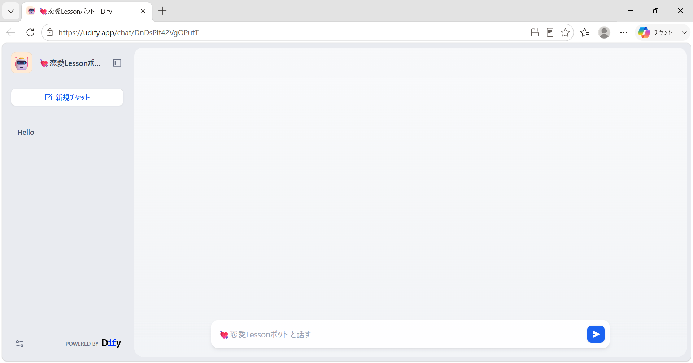

# 💘 恋愛Lessonボット

## 概要

恋愛経験が少ない方や自信がない方に向けて作成した恋愛相談AIです。

DifyとGeminiを利用し、相談者に寄り添いながら前向きな行動につながるアドバイスを提供します。

## 制作背景

Difyを活用したAIアプリ開発を学ぶために制作しました。

ユーザーに寄り添う回答を行うチャットボットをテーマに選び、
プロンプト設計や回答品質の改善を繰り返しながら開発を行いました。

## 使用技術

* Dify
* Gemini 3.5 Flash

## 主な機能

* 恋愛相談
* 恋愛タイプ診断
* 今日できる小さな一歩提案

## 工夫した点

- 否定しない回答設計
  - 恋愛相談では不安を抱える利用者が多いため、
    安心感を与える共感ファーストの回答を意識した。

- 複数の悩みに対応できるようプロンプトを改善
  - AIが1つの悩みだけに反応しないよう、
    複数の相談内容にも触れる指示を追加した。

## 学んだこと

* Difyを利用したAIアプリ開発
* プロンプト設計による回答品質の改善
* ユーザー視点でのUI・回答内容の検討
* テストと改善を繰り返す開発プロセス

## 今後の改善予定

- 複数の悩みに対する回答品質の向上
- より自然な恋愛タイプ診断の実装
- 長文相談への対応改善

## 制作者

ntakazawa-dev
